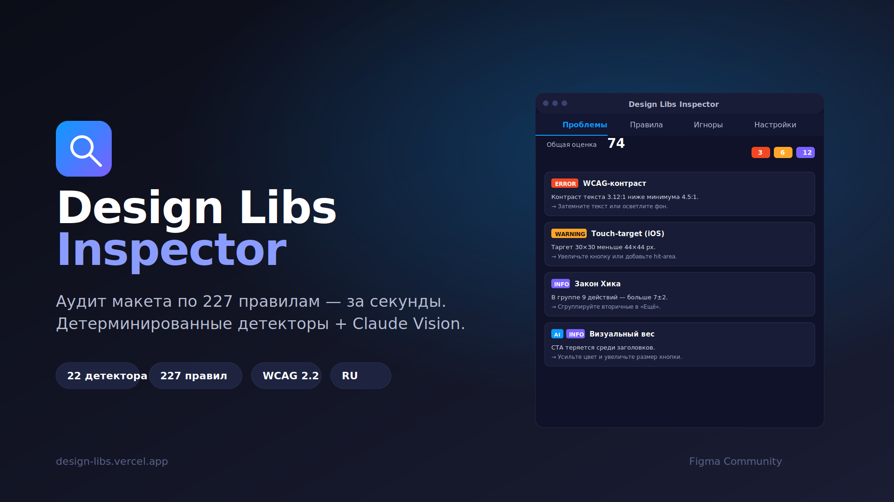

# Design Libs Inspector

Figma-плагин для аудита UI/UX-макетов по **227 правилам дизайна** (117 UX-законов + 110 UI-гайдлайнов из [design-libs](https://design-libs.vercel.app)). Гибрид детерминированных детекторов и Claude Vision.

<p align="center">
  
</p>

## Что умеет

- **21 детерминированный детектор** (strict-mode): контраст WCAG AA/AAA, touch-target iOS/Android/Web, типографическая шкала, палитра, размеры, тени, форма-поля, закон Хика.
- **AI-аудит через Claude Vision** — серверный прокси (бесплатно, лимит 20/час по IP) или BYOK с собственным ключом Anthropic.
- **Структурированные рекомендации** — каждая проблема имеет `title / summary / target / rationale / fix.steps / examples` + приоритет P1–P5.
- **Offline-first** — 227 правил встроены в бандл плагина (493 КБ). Работает без сети.
- **Каталог обновляется автоматически** — тихий refresh с `design-libs.vercel.app/api/figma-rules/v1` через ETag-ревалидацию.
- **Игноры** сохраняются в документе (`figma.root.pluginData`) — доступны всей команде файла.
- **MD-экспорт** отчёта в буфер обмена.
- **Локализация RU** с типографикой: «ёлочки», тире —.

## Архитектура

```
design-libs-plugin/
├─ manifest.json              # Figma Plugin API 1.0.0
├─ src/
│  ├─ sandbox/code.ts         # хост Figma API (es2017)
│  ├─ ui/App.tsx              # React 18 iframe
│  ├─ detectors/              # 21 алгоритм (22 слота, grid-snap отключён)
│  ├─ vision/
│  │  ├─ claude.ts            # BYOK клиент Anthropic
│  │  └─ server.ts            # прокси-клиент к v0-design-libs
│  ├─ screens/                # Issues / Learn / Ignored / Settings
│  ├─ shared/
│  │  ├─ recommendation.ts    # модель данных рекомендаций
│  │  ├─ rules-bundle.ts      # GENERATED — snapshot 227 правил
│  │  └─ rules-types.ts       # GENERATED — типы из design-libs
│  └─ storage/                # async-мост к figma.clientStorage
└─ dist/                      # сборка esbuild: code.js + ui.html
```

## Установка

### Для разработки

```bash
git clone https://github.com/avarentcov/design-libs-plugin.git
cd design-libs-plugin
npm install
npm run build
```

В Figma desktop: **Main menu → Plugins → Development → Import plugin from manifest…** → выбрать `manifest.json`.

### Watch-режим

```bash
npm run watch
```

После правки — в Figma **Plugins → Development → Design Libs Inspector → Reimport plugin**.

## Команды

| Скрипт | Что делает |
|---|---|
| `npm run build` | Сборка `dist/code.js` (5 КБ, es2017) + `dist/ui.html` (1.1 МБ) |
| `npm run watch` | Watch-сборка для dev-режима |
| `npm run sync-types` | Синхронизировать типы с `v0-design-libs` |
| `npm run embed-rules` | Пересобрать snapshot каталога (localhost → prod → fallback) |
| `npm run typecheck` | `tsc --noEmit` |
| `npm test` | Vitest: 34 теста (детекторы / recommendation / bundle / vision / бенчмарк) |

## API правил

Плагин читает каталог с публичного эндпоинта:

```
GET https://design-libs.vercel.app/api/figma-rules/v1
→ { version, updatedAt, count: 227, rules: [...] }
```

ETag-кеш 1 час. Источник — [avarentcov/v0-design-libs](https://github.com/avarentcov/v0-design-libs).

## AI-аудит

**Серверный режим (дефолт):**

Плагин → `POST https://design-libs.vercel.app/api/ai-audit/v1` → прокси на Anthropic с серверным `ANTHROPIC_API_KEY`. Rate-limit 20 запросов в час по IP.

**BYOK-режим:**

В «Настройках» → **Свой ключ Anthropic** → вставить `sk-ant-…`. Запросы идут напрямую в `api.anthropic.com` с `anthropic-dangerous-direct-browser-access: true`. Ключ хранится только в `figma.clientStorage` локально.

Модели: Haiku 4.5 / Sonnet 4.5 / Opus 4.5. Ответы через tool-use `report_issues` для гарантированного JSON.

## Детекторы (strict-mode)

| ID | Условия |
|---|---|
| `contrast-wcag` | error <AA (4.5/3), warning AA ok + AAA нет (<7/4.5) |
| `contrast-nontext` | error <3:1, warning <4.5:1 |
| `touch-target` | error <44/48/44 px, warning <48/56/48 px (iOS/A/W) |
| `button-min-size` | warning <48×48 |
| `target-spacing` | warning <32 px, info <40 px |
| `font-size-min` | error <12 px, warning <14 px |
| `line-height` | warning вне 1.35–1.75, info вне 1.5–1.6 |
| `line-length` | warning >100 CPL, info >80 |
| `letter-spacing` | warning вне −1…+3 %, info вне −0.5…+2 % |
| `font-sizes-scale` | warning >4, error >6 размеров |
| `font-families` | warning >2, error >3 семейств |
| `radius-consistency` | warning >2, error >4 вариантов |
| `stroke-consistency` | warning >2, error >4 толщин |
| `shadow-consistency` | warning >4, error >6 уровней |
| `palette-size` | warning >6, error >10 цветов |
| `dark-theme-purity` | warning на чистых #000/#FFF (только dark-mode) |
| `missing-label` | **error** для полей без видимой метки |
| `disabled-visible` | warning <4.5:1, error <3:1 |
| `focus-visible` | warning при отсутствии focus-состояний |
| `choice-count` | info >5, warning >7, error >9 (закон Хика) |
| `text-on-image` | info (ручная проверка) |

`grid-snap` отключён как слишком шумящий на autoLayout-макетах.

## Тесты

```bash
npm test
```

34 теста:
- 16 детекторов (contrast × 3, touch-target × 4, font-size-min × 3, missing-label × 2, choice-count × 4)
- 8 recommendation builder (priority, rationale из rule, fallback на application, стабильный id)
- 5 vision mock (парсинг tool-use, headers, ошибки, size-limit, валидация ввода)
- 4 rules-bundle (≥50 правил, доступные docUrl, auto-детекторы)
- 1 бенчмарк (p95 <500 мс на 51 ноде — сейчас ~1 мс)

## Связанные проекты

- **[v0-design-libs](https://github.com/avarentcov/v0-design-libs)** — Next.js сайт с каталогом правил. Хранит `ui-guide-data.ts` (110 UI-принципов) и `ux-laws-data.ts` (117 UX-законов). Эндпоинты `/api/figma-rules/v1` и `/api/ai-audit/v1` задеплоены на [design-libs.vercel.app](https://design-libs.vercel.app).
- **[Лендинг плагина](https://design-libs.vercel.app/plugin)** — страница с фичами и скриншотами.

## Лицензия

MIT
